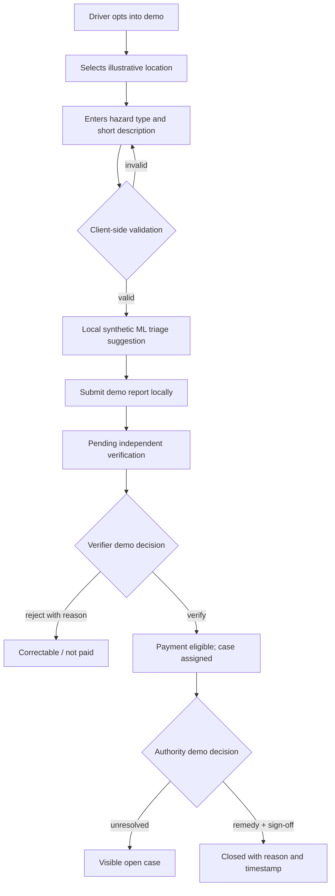
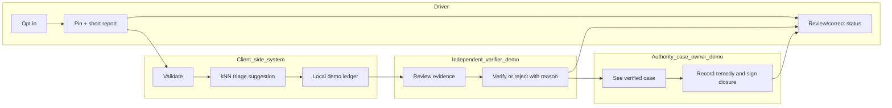

# PACKET — Ruta Clara / Week 7

**Owner:** Rodrigo Peña de León Pérez · **role:** Adversary · **status:** pre-code design packet, 23 Sep 2026

## Problem, in my words

A colectivo driver knows where a road hazard repeatedly appears, but that knowledge is rarely paid for, independently verified or visibly closed by the party able to act. A passenger may see a report but not whether anybody owns it. A raw sensor trace can become a worker score or an autonomous-training input. The Week 7 Team 4 Blueprint proposes a bounded Atizapán test but explicitly marks its bets and individual declarations as **pending a live team discussion/vote**. This prototype pressure-tests Rodrigo's proposed slice; it is not evidence of team approval or a real pilot.

## Exact user and job

Primary: a consenting colectivo driver with an older vehicle and intermittent connectivity who wants to report one hazard in under a minute, see whether it was independently verified, receive a *proposed* payment for a verified contribution and see the unresolved case remain visible. Secondary: a designated verifier and an authority/concession-holder case owner. In this demo those two roles are **simulated**, never impersonated as real institutions.

## Success definition

Before the module closes, a user can open the live demo, choose a location on an illustrative route map, submit a validated hazard report, see a small synthetic k-nearest-neighbors triage suggestion, optionally view a phone-motion sample (simulated by default), move the case through *submitted → independently verified → remedy pending → closed* using clearly labeled demo controls, and see a payment indicator become eligible at verification rather than at authority closure. An unresolved case remains listed. Nothing on screen claims a reduced crash rate or a real payout.

## Image-generated mockup

Generated 23 Sep 2026 as a design reference. The route names, street depiction, status and pothole image are illustrative; the actual route/stop pair has not been confirmed. Prompt: “High-fidelity mobile UI for a worker-controlled paid road-hazard ledger for colectivo drivers in Atizapán; report action, route map, independent verification, authority closure pending; no real personal data or safety claims.” A targeted edit corrected the payment card to say payment for a verified report does not depend on authority closure. The implementation may differ for usability and accessibility.

## Feature flow

## Benchmark line

Best comparable public-reporting workflow: **FixMyStreet** routes a geographically pinned issue to the responsible body, shows reports publicly and lets people track updates; its platform also supports staff status workflows. [Official platform explanation](https://fixmystreet.org/how-it-works/) and [administrator status model](https://fixmystreet.org/running/admin_manual/). Mine narrows the setting to a Mexican colectivo corridor and adds a paid, correctable worker contribution plus an explicit ban on surveillance, insurance/licensing scoring and autonomous-training reuse without fresh approval. “Best” here means the clearest relevant public benchmark found, not a measured global ranking.

## Three-year view

If this slice works in a real, consented test, it becomes a maintained corridor evidence service that links paid driver knowledge to verified hazards and accountable repairs. It may add aggregated passenger reliability only when cost, data quality and worker burden warrant it. It never becomes a driver score or a silent training-data pipeline; any broader data use needs a new worker decision, compensation and an income-protecting transition.

## Scope cut

No ride-hailing, dispatch optimization, passenger tracking, individual driver ranking, surveillance, autonomous driving, real payouts, institutional case submission or claim of measured safety impact. No real corridor, operator, payer or data controller is asserted. No personal data is requested or stored. Motion data, if available, is one opt-in local sample, never continuous tracking.

## Architecture and stack

| Layer | Week 7 Dragon Stack role | Implementation / guardrail |
| --- | --- | --- |
| Illustrative geographic route map | Geodata/maps | SVG route anchored to illustrative latitude/longitude points; tap to place a hazard pin; explicitly not a validated transit map |
| Triage assistant | ML | Small k-nearest-neighbors classifier trained on invented, labeled motion examples; suggests review priority only; no automatic sanctions or closure |
| Motion sample | Phone telemetry/sensors | Opt-in, one-shot DeviceMotion sample where supported; simulation fallback; keep only peak magnitude in demo state and discard raw event |
| Workflow ledger | Product logic | Validated inputs; explicit driver, verifier and case-owner demo states; payment eligibility at verification; visible unresolved count |
| Delivery | Free static web | HTML/CSS/ES modules; no server secrets, login, database or external API; responsive layout, keyboard-accessible controls |

## Blueprint conditions as acceptance gates

1. Before any real pilot: name actual corridor and stop pair, consenting operator, payer, data controller, verifier and authority/concession-holder closure signer. All are **TBD** here.
2. Real measurement requires a two-week baseline and route/time measures for waits, crowding, breakdown reports, verified hazards, response time, unresolved cases, false positives, driver burden and cost. This app shows demo case counts only; it cannot infer safety improvement.
3. Any passenger-facing output must be aggregated. This driver-facing demo exposes no unit or personal identifier and cannot dispatch, subsidize or sanction automatically.
4. Worker participation is voluntary; knowledge is paid, correctable, access-limited and retention-limited. Real compensation terms must be agreed with workers before launch.
5. Shadow clause: no employment surveillance, insurance/licensing scores or autonomous-training reuse without fresh worker approval, compensation and an income-protecting transition. Declining cannot cost a route or job.
6. The app must be usable on older phones with low input burden; offline support, maintenance and support costs need validation before a real pilot.

## Test plan

- Unit-test input bounds, required fields, valid coordinates, state transitions, payment eligibility and kNN determinism.
- Test the mobile task end to end: pin → report → verify → pay eligibility → leave unresolved → close with signed remedy. Confirm rejection remains correctable and does not pay.
- Confirm that no secrets, personal data or non-demo outcomes ship. Confirm copy says “simulado” on every workflow state.
- Mechanical pass: record at least one actual bug found, fix it, rerun tests and redeploy; no fictional test results.
- Persona pass: fresh synthetic-user chat, screenshots in order, confusion log and one fixed issue. Mark it simulated, not field research.
- Confirm production HTTPS URL, two deployments, five commits, video and PDF artifacts separately. Until verified, these are **pending**, not claims.

## Open decisions / launch blockers

Exact corridor and stop pair; operator; independent verifier; authority/concession-holder signer; payer and compensation amount; controller/retention and correction process; data-use rights; worker vote. The Blueprint specifically does not record a unanimous vote or completed live debate.
