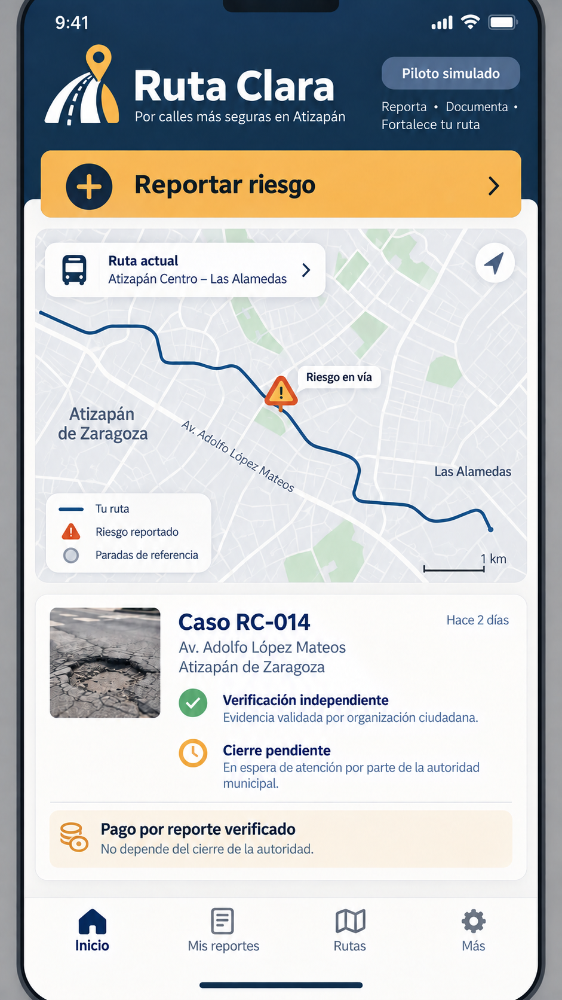
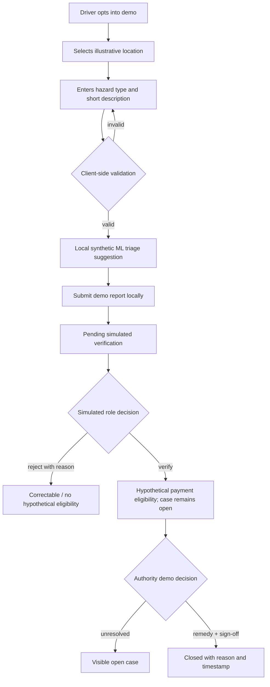
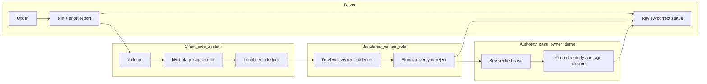

# PACKET — Ruta Clara / Week 7

**Owner:** Rodrigo Peña de León Pérez · **role:** Adversary · **status:** scope packet drafted before implementation; evidence state updated 24 Sep 2026

## Problem, in my words

This prototype tests a hypothesis: a colectivo driver may want to contribute local hazard knowledge, see whether a report was reviewed, and know whether an unresolved case has an owner. We have not established that this is an unmet need, that current WhatsApp/call/spreadsheet workarounds fail, or that drivers want a separate ledger. Safety data could also become worker evaluation or autonomous-training input. The Week 7 Team 4 Blueprint is a provisional draft; its bets and individual declarations remain **pending a live team discussion/vote**. This prototype is Rodrigo's proposed slice, not team approval or a real pilot.

## Exact user and job

**Primary-user hypothesis:** an adult colectivo driver on a not-yet-confirmed corridor who might report a road hazard and want a visible correction/status trail without creating a punitive worker record. No driver has validated this job. Phone capability, connectivity, completion time, willingness to switch from current channels, and willingness to contribute are unvalidated. The demo's anonymous user is not identified as a real worker. The verifier and authority/concession-holder case-owner roles are **simulated**, not real institutions.

## Success definition

**Functional acceptance claim:** “A user can complete, correct, and inspect a simulated hazard-report workflow with simulated verification and closure, while the app preserves unresolved cases and prevents the ML output from deciding payment eligibility, sanctions, verification, closure, or truth.” The cases live only in local in-browser demo state. The map and all test cases are illustrative/invented. The UI uses “Elegibilidad hipotética (demo)”; no transfer occurs. Passing these tests establishes only the implemented workflow, not real worker control, adoption, institutional response, comparative performance, or improved safety.

## Image-generated mockup

Generated 23 Sep 2026 as a design reference. The route names, street depiction, status and pothole image are illustrative; the actual route/stop pair has not been confirmed. The original image-generation prompt describes worker control and independent verification as design aspirations, not implemented properties; those elements were narrowed in the later code and wording audit. A targeted edit corrected the payment card to say payment for a verified report does not depend on authority closure. The implementation may differ for usability and accessibility.

## Feature flow

## Benchmark line

Relevant public-reporting workflow benchmark: **FixMyStreet** provides a reference for geographically pinned public-issue reporting and visible status workflows ([platform explanation](https://fixmystreet.org/how-it-works/); [administrator status model](https://fixmystreet.org/running/admin_manual/)). The more consequential local substitute is the Municipality of Atizapán's **Atizapán te Escucha**: the municipality describes geolocated public-service reports (including potholes) routed to the relevant directorate and followed through resolution ([municipal app description](https://atizapan.gob.mx/?p=4395); [current service portal](https://atizapan.gob.mx/?page_id=8117)). Its 2025 municipal rules describe phone-number requirements for the web reporting process and three-year retention of generated personal data for statistical purposes ([official Gaceta 279](https://atizapan.gob.mx/wp-content/uploads/2025/01/GACETA-279.pdf)); do not assume those exact terms apply identically to every app path. These official descriptions do not establish current service performance or that a specific colectivo uses it. They do mean Ruta Clara cannot claim a unique pothole-reporting/closure function. Its possible distinction—worker-specific contribution and governance protections—remains unvalidated and is not implemented as enforceable rights in this demo.

## Three-year view

If discovery validates the need and a real, consented test succeeds, a future service might aim to link compensated driver contributions with independent verification and institutionally owned case closure. That is not a commitment or current capability. Any aggregation would require validated data quality, cost, worker-burden and governance evidence. Any broader data use would require a new, purpose-specific worker decision and agreed compensation; this prototype provides no operational veto, retention policy, payment, or income-protection mechanism.

## Scope cut

No ride-hailing, dispatch optimization, passenger tracking, individual driver ranking, surveillance, autonomous driving, real payouts, institutional case submission or claim of measured safety impact. No real corridor, operator, payer or data controller is asserted. The form does not request personal data, but free text is not technically screened and could contain it; any entered text and derived motion peak remain temporarily in the current tab's memory until reload or close, with no server submission. Motion capture, if opted into on a compatible device with permission, lasts three seconds; raw events are discarded after calculating a peak. GPS and continuous tracking are not used.

## Architecture and stack

| Layer | Week 7 Dragon Stack role | Implementation / guardrail |
| --- | --- | --- |
| Illustrative geographic route map | Geodata/maps | SVG route anchored to illustrative latitude/longitude points; tap to place a hazard pin; explicitly not a validated transit map |
| Triage assistant | ML | Small k-nearest-neighbors classifier trained on invented, labeled examples; suggests review attention only; not field validated and has no workflow decision authority |
| Motion sample | Phone telemetry/sensors | Opt-in, one-shot DeviceMotion sample where supported; simulation fallback; keep only peak magnitude in demo state and discard raw event |
| Workflow ledger | Product logic | Validated inputs; one anonymous demo user operates simulated driver/verifier/case-owner roles; hypothetical payment eligibility follows simulated verification; visible unresolved count |
| Delivery | Free static web | HTML/CSS/ES modules; no server secrets, login, database or external API; responsive layout, keyboard-accessible controls |

## Blueprint conditions as acceptance gates

1. Before any real pilot: name actual corridor and stop pair, consenting operator, payer, data controller, verifier and authority/concession-holder closure signer. All are **TBD** here.
2. Real measurement requires a two-week baseline and route/time measures for waits, crowding, breakdown reports, verified hazards, response time, unresolved cases, false positives, driver burden and cost. This app shows demo case counts only; it cannot infer safety improvement.
3. Any future passenger-facing output must be aggregated. This demo requests no unit/person identifier and cannot dispatch, subsidize or sanction automatically, but free text is not technically screened for personal data.
4. A real pilot must make participation voluntary and define compensation, access, correction, deletion, retention and appeal rules with workers before launch. This prototype demonstrates only a local correction flow and a **simulated** payment-eligibility label; it does not implement real worker rights or payment.
5. Shadow clause: no employment surveillance, insurance/licensing scores or autonomous-training reuse without fresh worker approval, compensation and an income-protecting transition. Declining cannot cost a route or job.
6. The app must be usable on older phones with low input burden; offline support, maintenance and support costs need validation before a real pilot.

## Verification and current evidence

The public demo is at <https://rodrigobuilds3-creator.github.io/ruta-clara-week7/>; source is at <https://github.com/rodrigobuilds3-creator/ruta-clara-week7>. The assignment's minimum of two deployments and five meaningful commits was exceeded by the last verified public release (three successful deployments and 13 commits, before this pending copy revision). The current copy revision is local until a new deployment succeeds. The live app is a static HTML/CSS/ES-module demo; there is no backend, account, database, external submission, or actual institutional connection. User-entered text exists in browser-tab memory during a session, so the UI warns against real names or identifying details; the form does not technically screen every personal detail.

Four acceptance checks define the limited functional claim:

1. Create and inspect one invented report at an illustrative point; display an automated review suggestion only; simulate verification and show “Elegibilidad hipotética (demo)” while the case remains unresolved and no money is transferred.
2. Reject an invented report with a reason; confirm no payment eligibility, preserve the case as unresolved, allow correction/resubmission and retain the transition history.
3. With multiple cases, close one verified case only after a sufficiently detailed simulated remedy; reject closure before verification or without the required remedy; confirm only closed cases leave the unresolved count.
4. Confirm the model module only returns its suggestion and cannot transition workflow state; inspect public copy that says the suggestion does not establish risk or determine payment/sanctions.

`docs/TEST_LOG.md` records the real defect, regression, three successful public deployments before this copy revision, 11 passing CI tests at that release, and live retest. The current local copy revision passes 12/12 tests and builds five public files; new CI/deployment and live acceptance smoke-test evidence are still pending. These tests establish software behavior only. They do not establish safety outcomes, a real payment, institutional ownership, driver demand, an offline capability, a comparative advantage over WhatsApp/spreadsheets, or reduced crashes. No supported-phone sensor-permission test or intermittent-connectivity test is claimed. The fresh-chat synthetic-persona review is text-only because no screenshots were attached; it is not field evidence. A live video has not been recorded.

## Open decisions / launch blockers

Exact corridor and stop pair; operator; independent verifier; authority/concession-holder signer; payer and compensation amount; controller/retention, deletion and appeal process; data-use rights; worker vote; observed driver need; comparative baseline. The Blueprint specifically does not record a unanimous vote or completed live debate.
